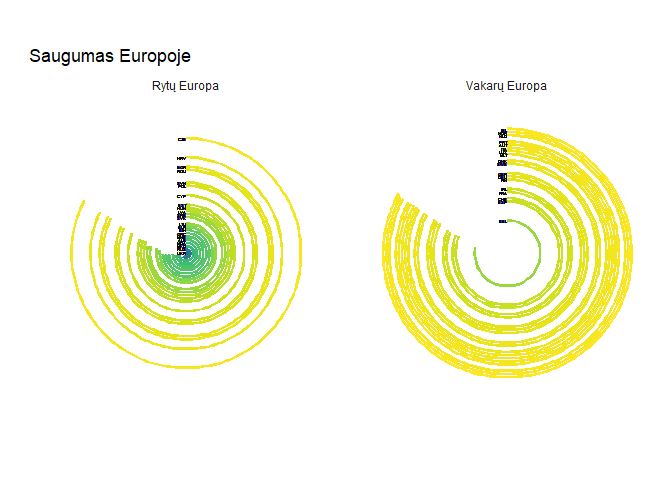

Stulpeliniai grafikai
================

Duomenų pakrovimas
------------------

``` r
source("tools/human_freedom_GINI_duomenys.R")
res<-load_europe("data")
europa = res$europa
gini = res$gini
```

Grafikams naudosime Human Freedom Index duomenis. Duomenis vaizduosime stulpeliniais grafikais.

Pagrindinė biblioteka ggplot2.

Bibliotekos
-----------

``` r
library(tidyr)
library(dplyr)

library(esquisse)
library(ggedit)

library(ggplot2)
library(RColorBrewer)
library(reshape2)
library(scales)
library(ggthemes)
library(wesanderson)
library(viridis)
library(ggsci)
library(ggrepel)
```

Paprastas stulpelinis grafikas
------------------------------

``` r
europa %>%
  filter(year==2016) %>%
  ggplot(aes(x = ISO_code, y = ef_regulation_labor, fill = region)) +
    geom_bar(stat="identity") +
    geom_text(aes(label=round(ef_regulation_labor, digits = 1)),
              vjust=1.6,
              color="black",
              size=2.5)+
    labs(title = "Darbo santykių valstybinis reguliavimas",
         x = NULL,
         y = "Darbo santykių reguliavimas",
         fill = "Regionas",
         caption = "*pastabos",
         subtitle = "Rytų ir Vakarų Europoje") +
   scale_fill_brewer(palette = "Paired",
                     labels=c("Rytų Europa", "Vakarų Europa")) +
   theme_classic()
```


Stulpelių lyginimas įvairiais pjūviais (1)
------------------------------------------

``` r
europa%>%
  group_by(year, region)%>%
  summarise(m=mean(ef_regulation_labor, na.rm = TRUE))%>%
  ggplot(aes(x = year, y = m, fill = region)) +
  geom_bar(stat = "identity", position = "stack") +
    coord_flip()+
    facet_grid(year ~ .)+
    theme(
    panel.background = element_rect(fill = "white",
                                    colour = "white",
                                    size = 0.5,
                                    linetype = "solid"), 
          axis.title.x=element_blank(),
          axis.text.x=element_blank(),
          axis.ticks.x=element_blank(),axis.title.y=element_blank(),
          axis.text.y=element_blank(),
          axis.ticks.y=element_blank())+
    theme(legend.title=element_blank())+
    scale_fill_brewer(palette = "Set1",
                      labels=c("Rytų Europa", "Vakarų Europa"))
```


Stulpelių lyginimas įvairiais pjūviais (2)
------------------------------------------

``` r
region.labs <- c("Rytų Europa", "Vakarų Europa")
names(region.labs) <- c("Eastern Europe", "Western Europe")
   
europa%>%
  group_by(year, region)%>%
  summarise(m=mean(ef_regulation_labor, na.rm = TRUE))%>%
  ggplot(aes(x = year, y = m, fill = region)) +
  geom_bar(stat = "identity", position = "stack") +
    coord_flip()+
    theme(
      panel.background = element_rect(fill = NA),
      panel.grid.major = element_line(colour = "grey50"),                            #palikti langelius fone
      axis.title.x=element_blank(),
      #axis.text.x=element_blank(),
      axis.ticks.x=element_blank(),
      axis.title.y=element_blank(),
      axis.text.y=element_blank(),
      axis.ticks.y=element_blank())+
    theme(legend.title=element_blank())+
    guides(fill = FALSE, color = FALSE, linetype = FALSE, shape = FALSE)+            #ištrinti legendas
    scale_fill_brewer(palette = "Set2",
                      labels=c("Rytų Europa", "Vakarų Europa"))+
    facet_grid(year ~ region,
               labeller = labeller(region = region.labs))
```


Stulpelių lyginimas įvairiais pjūviais (3)
------------------------------------------

``` r
europa%>%
  group_by(year, region)%>%
  summarise(m=mean(ef_regulation_labor, na.rm = TRUE))%>%
ggplot( aes(x = year, y = m, fill = region)) +
  geom_bar(stat = "identity", position = position_dodge(5.8), width = 5) +
  coord_flip()+
  labs(title = "Darbo santykių valstybinis reguliavimas",
       fill="Regionas")+
  scale_fill_brewer(palette = "Set1",
                    labels=c("Rytų Europa", "Vakarų Europa"))+
  scale_x_discrete(name=NULL, breaks=NULL) +                                          #galima ir pervadinti labels=c("a", "b", "c")
  scale_y_continuous(name ="darbo santykių reguliavimas",
                     breaks=seq(0,10,1))+
  theme_bw()+
      facet_grid(year ~ .)
```


Paprastas išrikiavimas
----------------------

``` r
europa %>% filter(year==2016) %>%
  ggplot(aes(x=reorder(countries, pf_ss), y=pf_ss, fill=pf_ss)) +
  geom_bar(stat="identity") +
  theme(axis.title.y=element_text(angle=0)) +
  theme(axis.text.x = element_text(angle=45, vjust = 1, hjust=1))+
  geom_text(aes(label=round(pf_ss, digits = 1)),
            position=position_dodge(width=0.9), vjust=-0.25, size=2.8)+
  theme(
    panel.background = element_rect(fill = NA),
    axis.title.x=element_blank(),
    #axis.text.x=element_blank(),
    axis.ticks.x=element_blank(),
    axis.title.y=element_blank(),
    axis.text.y=element_blank(),
    axis.ticks.y=element_blank())+
  labs(title = "Saugumas Europoje",
       fill="Saugumo indeksas")+
  scale_fill_viridis()
```


Stulpeliai ratu
---------------

``` r
europa %>% filter(year==2016) %>%
  ggplot(aes(x=reorder(countries, pf_ss), y=pf_ss, fill=pf_ss)) +
  geom_bar(stat="identity") +
  theme_light()+
  theme(axis.title.y=element_blank()) + 
  theme(axis.text.x = element_text(angle=45, vjust = 1, hjust=1))+
  theme(axis.text.x = element_text(angle=-20))+
  theme(panel.grid.major = element_blank(),
        panel.grid.minor = element_blank())+
  coord_polar()+
  labs(title = "Saugumas Europoje",
       fill="Saugumo indeksas",
       x=NULL,
       y=NULL)+
  scale_fill_viridis()
```


Jei saugumas Europoje būtų pavaizduotos kaip pyragas
----------------------------------------------------

``` r
region.labs <- c("Rytų Europa", "Vakarų Europa")                      
names(region.labs) <- c("Eastern Europe", "Western Europe")
europa %>% filter(year==2016) %>%
  ggplot(aes(x=reorder(ISO_code, pf_ss), y=pf_ss, fill=pf_ss)) + 
  geom_bar(width = 0.85, stat="identity") + 
  coord_polar(theta = "y") +
  xlab("") + ylab("") +
  ylim(c(0,12)) +                                                                      #keicia apskritimo dydi
  ggtitle("Saugumas Europoje") +
  geom_text(data = europa, hjust = 1, size = 1,
            aes(x = reorder(ISO_code, pf_ss), y = 0, label = reorder(ISO_code, pf_ss))) +
  theme_minimal() +
  theme(legend.position = "none",
        panel.grid.major = element_blank(),
        panel.grid.minor = element_blank(),
        axis.line = element_blank(),
        axis.text.y = element_blank(),
        axis.text.x = element_blank(),
        axis.ticks = element_blank())+
  scale_fill_viridis("cividis")+
  facet_wrap(~region,
             labeller = labeller(region = region.labs))
```


