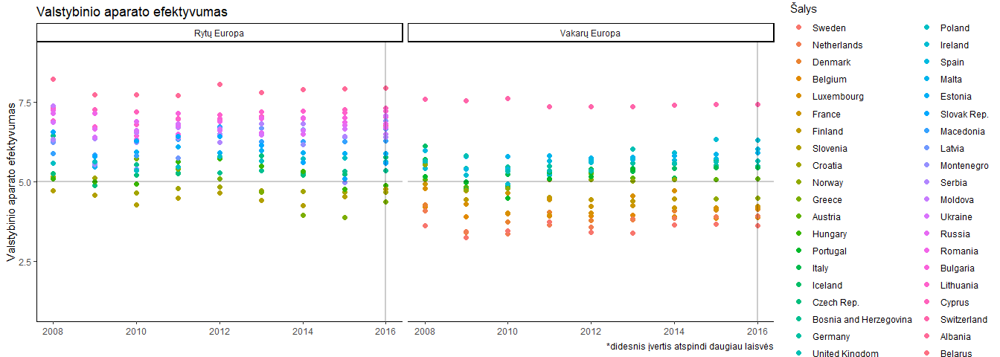
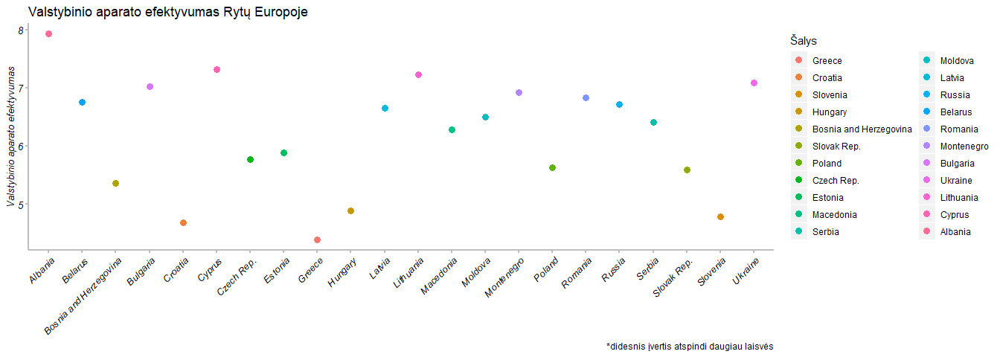

Duomenų vaizdavimas - pagrindai
================

\`\`\` \#\# duomenų pakrovimas

``` r
source("tools/human_freedom_GINI_duomenys.R")
res<-load_europe("data")
europa = res$europa
gini = res$gini
```

Bibliotekos
-----------

``` r
library(tidyr)
library(dplyr)

library(esquisse)
library(ggedit)

library(ggplot2)
library(RColorBrewer)
library(reshape2)
library(scales)
library(ggthemes)
library(wesanderson)
library(viridis)
library(ggsci)
library(ggrepel)
```

Duomenų vaizdavimas
-------------------

Taip, vizualizuojant duomenis dažniausiai naudojamas ggplot2. Duomenų atvaizdavimas su ggplot užima daug laiko. Jei prireikia greičio, galima naudoti pagalbinius įrankius.

esquisser() funkcija paleidžia interaktyvų langą, kuriame formuojamas grafikas.

Jei grafikas jau sudarytas ggplot2 pagalba, tačiau norima patobulinti jo apipavidalininimą, galima išviesti ggedit funkciją.

Pvz.:

ggedit(grafikas)

Toliau tęsime su ggplot. Pavaizduosime Human Freedom Index duomenis. Pažiūresime, kaip Europos šalyse yra įvertintas valstybinio aparato efektyvumas. Šiais grafikais iliustruosime pagrindinius grafiko nuastatymus.

Kaip keisti pavadinimus?
------------------------

``` r
region.labs <- c("Rytų Europa", "Vakarų Europa")                       #kodas perrašyti "facet" pavadinimus
names(region.labs) <- c("Eastern Europe", "Western Europe")

ggplot(europa,
       aes(x = year,
           y = ef_government,
           color=reorder(countries, ef_government))) +                 #reorder naudojamas susikirstymui
       geom_point(size=3) +
       labs(title = "Valstybinio aparato efektyvumas..?",              #pavadinimai, kai be pavadinimo = NULL
           x = NULL,
           y = "Valstybinio aparato efektyvumas",
           caption = "*didesnis įvertis atspindi daugiau laisvės",
           color="Šalys")+
       theme_classic()+                                                #šviesus fonas, kuriame lieka ašys
       ylim(1, 9)+                                                     #I būdas, nurodyti ašies ribas
       scale_x_continuous(breaks = seq(2008, 2016, 1))+                #II būdas, nurodyti ašies ribas ir grafos dydį
       geom_hline(yintercept=5, color="black", size=1, alpha=0.2) +    #tiesė, ketanti y ašį
       geom_vline(xintercept=2016, color="black", size=1, alpha=0.2)+  #tiesė, kertanti x ašį
       facet_wrap(~region, labeller = labeller(region = region.labs))  #kodas perrašyti "facet" pavadinimus
```

    ## Warning: Removed 8 rows containing missing values (geom_point).



Kaip modifikuoti ašis?
----------------------

``` r
europa %>%
  filter(region=="Eastern Europe", year=="2016")%>%
  ggplot(aes(x = countries,
           y = ef_government,
           color=reorder(countries, ef_government))) +
  geom_point(size=3) +
  labs(title = "Valstybinio aparato efektyvumas Rytų Europoje",
       x = NULL,
       y = "Valstybinio aparato efektyvumas",
       caption = "*didesnis įvertis atspindi daugiau laisvės",
       color="Šalys")+
  theme(axis.text.x = element_text(colour = 'black',                   #ašių nustatymas
                                   angle = 45,
                                   size = 10,
                                   hjust = 1,
                                   face = 'italic'),
        axis.title.x = element_text(colour = 'black',
                                    angle = 0,
                                    size = 10,
                                    face = 'italic'),
        axis.text.y = element_text(colour = 'black',
                                   angle = 0,
                                   size = 10,
                                   face = 'italic'),
        axis.title.y = element_text(colour = 'black',
                                    angle = 90,
                                    size = 10,
                                    face = 'italic'),
        axis.line = element_line(colour = 'grey',
                                 size = 1,
                                 linetype = 'solid'),                  #galima blank/dotted
        axis.ticks = element_line(colour = 'grey',
                                  size = 1,
                                  linetype = 'dashed'),
        axis.ticks.length = unit(1, "mm"))+
  theme(panel.background = element_rect(fill = "white",
                                        colour = "white"))
```



Kaip nustatyti baltą foną?
--------------------------

``` r
europa %>%
  filter(region=="Eastern Europe", year=="2016")%>%
  ggplot(aes(x = countries,
             y = ef_government,
             color=reorder(countries, ef_government))) +
  geom_point(size=3) +
  labs(title = "Valstybinio aparato efektyvumas Rytų Europoje",
       x = NULL,
       y = "Valstybinio aparato efektyvumas",
       caption = "*didesnis įvertis atspindi daugiau laisvės")+
  theme(
    panel.background = element_rect(fill = "white", colour = "white", size = 0.5, linetype = "solid"), 
    axis.title.x=element_blank(),
    axis.text.x=element_blank(),
    axis.ticks.x=element_blank(),axis.title.y=element_blank(),
    axis.text.y=element_blank(),
    axis.ticks.y=element_blank())+
    theme(legend.title=element_blank())  
```


