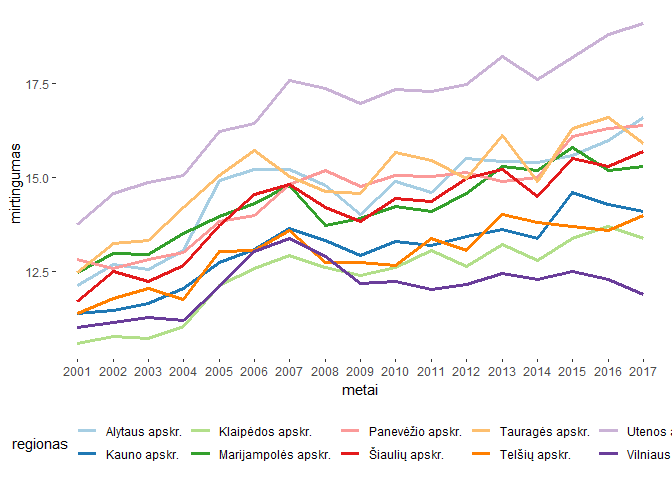
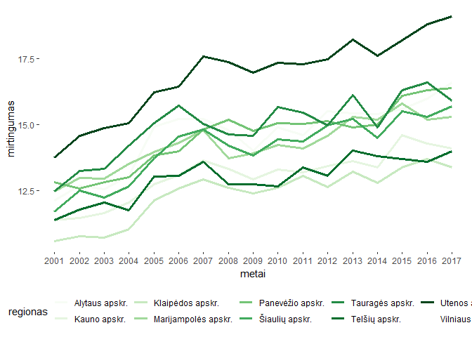
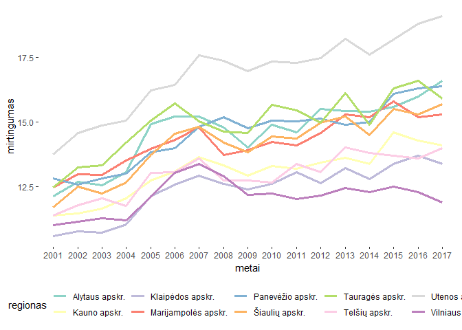
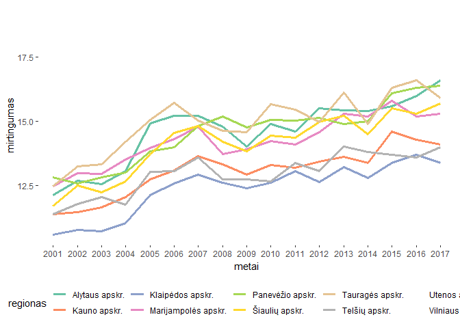
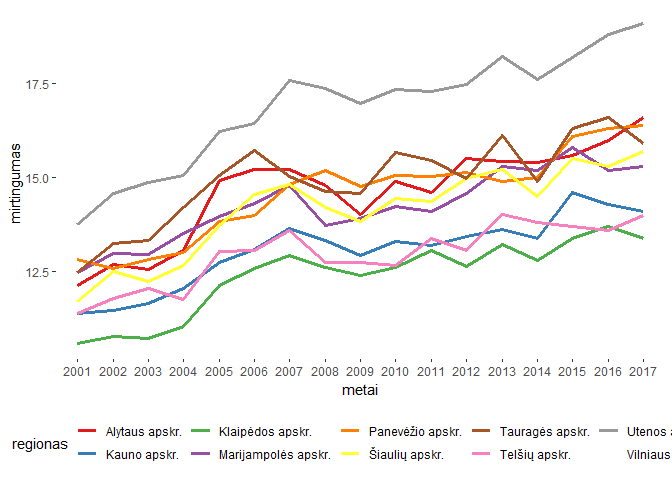
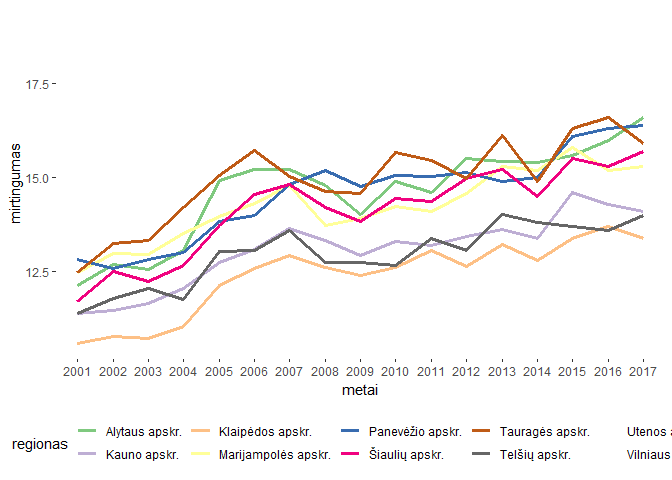
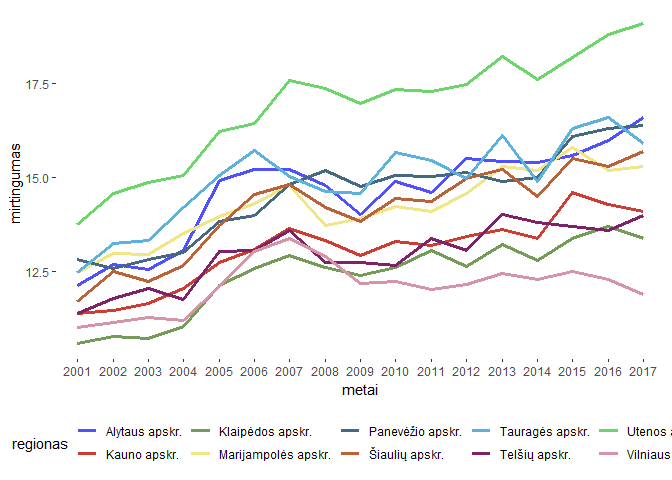
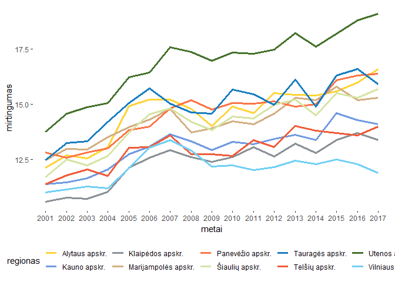
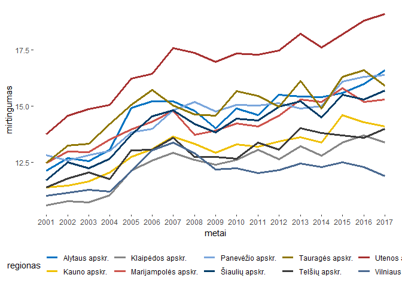
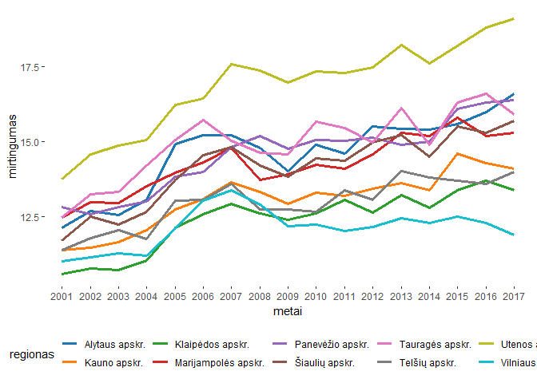

Spalvos
================

Duomenų pakrovimas
------------------

Pakraunam Higienos instituto atviruosius duomenis apie Lietuvoje gyvenančių žmonių sveikatos rodiklius.

``` r
source("tools/lietuvos_sveikatos_duomenys.R")
res<-load_lietuva("data")
LT = res$LT
LT1 = res$LT1
```

Reikalingos R bibliotekos
-------------------------

``` r
library(ggplot2)
library(tidyr)
library(dplyr)

library(RColorBrewer)
library(scales)
library(ggthemes)
library(wesanderson)
library(viridis)
library(ggsci)
```

populiarios RColorBrewer paletes
================================

Pavyzdžiai

Paired

``` r
LT %>% filter(ID %in% c("62":"71"))%>% 
  ggplot(aes(x=metai, y=mirtingumas, colour = regionas, group = regionas)) +
  geom_line(size=1.3)+
  theme(legend.position="bottom", legend.key = element_rect(colour = NA, fill = NA))+
  theme(panel.background = element_rect(fill = "white", colour = "white"))+
  scale_color_brewer(palette = "Paired")
```



Set4

``` r
LT %>% filter(ID %in% c("62":"71"))%>% 
  ggplot(aes(x=metai, y=mirtingumas, colour = regionas, group = regionas)) +
  geom_line(size=1.3)+
  theme(legend.position="bottom", legend.key = element_rect(colour = NA, fill = NA))+
  theme(panel.background = element_rect(fill = "white", colour = "white"))+
  scale_color_brewer(palette = "Set4")
```



Set3

``` r
LT %>% filter(ID %in% c("62":"71"))%>% 
  ggplot(aes(x=metai, y=mirtingumas, colour = regionas, group = regionas)) +
  geom_line(size=1.3)+
  theme(legend.position="bottom", legend.key = element_rect(colour = NA, fill = NA))+
  theme(panel.background = element_rect(fill = "white", colour = "white"))+
  scale_color_brewer(palette = "Set3")
```



Set2

``` r
LT %>% filter(ID %in% c("62":"71"))%>% 
  ggplot(aes(x=metai, y=mirtingumas, colour = regionas, group = regionas)) +
  geom_line(size=1.3)+
  theme(legend.position="bottom", legend.key = element_rect(colour = NA, fill = NA))+
  theme(panel.background = element_rect(fill = "white", colour = "white"))+
  scale_color_brewer(palette = "Set2")
```



Set1

``` r
LT %>% filter(ID %in% c("62":"71"))%>% 
  ggplot(aes(x=metai, y=mirtingumas, colour = regionas, group = regionas)) +
  geom_line(size=1.3)+
  theme(legend.position="bottom", legend.key = element_rect(colour = NA, fill = NA))+
  theme(panel.background = element_rect(fill = "white", colour = "white"))+
  scale_color_brewer(palette = "Set1")
```



Accent

``` r
LT %>% filter(ID %in% c("62":"71"))%>% 
  ggplot(aes(x=metai, y=mirtingumas, colour = regionas, group = regionas)) +
  geom_line(size=1.3)+
  theme(legend.position="bottom", legend.key = element_rect(colour = NA, fill = NA))+
  theme(panel.background = element_rect(fill = "white", colour = "white"))+
  scale_color_brewer(palette = "Accent")
```



kitos paletės:

-   scale\_fill\_brewer(palette = "Dark2") \# scale\_color\_brewer(palette = "Dark2")
-   scale\_fill\_brewer(palette = "Spectral") \# scale\_color\_brewer(palette = "Spectral")

ggsci
-----

Gražiai užvadintos spalvines paletes:

-   scale\_color\_npg() \# scale\_fill\_npg()
-   scale\_color\_aaas() \# scale\_fill\_aaas()
-   scale\_color\_lancet() \# scale\_fill\_lancet()
-   scale\_color\_nejm() \# scale\_fill\_nejm()
-   scale\_color\_jama() \# scale\_fill\_jama()
-   scale\_color\_ucscgb() \# scale\_fill\_ucscgb()
-   scale\_color\_uchicago() \# scale\_fill\_uchicago()
-   scale\_color\_startrek() \# scale\_fill\_startrek()
-   scale\_color\_tron() \# scale\_fill\_tron()
-   scale\_color\_futurama() \# scale\_fill\_futurama()
-   scale\_color\_rickandmorty() \# scale\_fill\_rickandmorty()
-   scale\_color\_locuszoom() \# scale\_fill\_locuszoom()

Patikę pavyzdžiai: scale\_color\_igv() \# scale\_fill\_igv()

``` r
LT %>% filter(ID %in% c("62":"71"))%>% 
  ggplot(aes(x=metai, y=mirtingumas, colour = regionas, group = regionas)) +
  geom_line(size=1.3)+
  theme(legend.position="bottom", legend.key = element_rect(colour = NA, fill = NA))+
  theme(panel.background = element_rect(fill = "white", colour = "white"))+
  scale_color_igv()
```



scale\_color\_simpsons() \# scale\_fill\_simpsons()

``` r
LT %>% filter(ID %in% c("62":"71"))%>% 
  ggplot(aes(x=metai, y=mirtingumas, colour = regionas, group = regionas)) +
  geom_line(size=1.3)+
  theme(legend.position="bottom", legend.key = element_rect(colour = NA, fill = NA))+
  theme(panel.background = element_rect(fill = "white", colour = "white"))+
  scale_color_simpsons()
```



scale\_color\_d3() \# scale\_fill\_d3()

``` r
LT %>% filter(ID %in% c("62":"71"))%>% 
  ggplot(aes(x=metai, y=mirtingumas, colour = regionas, group = regionas)) +
  geom_line(size=1.3)+
  theme(legend.position="bottom", legend.key = element_rect(colour = NA, fill = NA))+
  theme(panel.background = element_rect(fill = "white", colour = "white"))+
  scale_color_jco()
```



scale\_color\_jco() \# scale\_fill\_jco()

``` r
LT %>% filter(ID %in% c("62":"71"))%>% 
  ggplot(aes(x=metai, y=mirtingumas, colour = regionas, group = regionas)) +
  geom_line(size=1.3)+
  theme(legend.position="bottom", legend.key = element_rect(colour = NA, fill = NA))+
  theme(panel.background = element_rect(fill = "white", colour = "white"))+
  scale_color_d3()
```



Wes Andersono
-------------

Yra net Wes Andersono filmų spalvinės paletės, bet tik apytiksliai 5 spalvom:

scale\_fill\_manual(values = wes\_palette("Royal2"))

-   (values = wes\_palette("Royal2"))
-   (values = wes\_palette("BottleRocket1"))
-   (values = wes\_palette("BottleRocket2"))
-   (values = wes\_palette("Rushmore1"))
-   (values = wes\_palette("Rushmore"))
-   (values = wes\_palette("Zissou1"))
-   (values = wes\_palette("Darjeeling2"))
-   (values = wes\_palette("Chevalier1"))
-   (values = wes\_palette("FantasticFox1"))
-   (values = wes\_palette("Moonrise1"))
-   (values = wes\_palette("Moonrise2"))
-   (values = wes\_palette("Moonrise3"))
-   (values = wes\_palette("Cavalcanti1"))
-   (values = wes\_palette("GrandBudapest1"))
-   (values = wes\_palette("GrandBudapest2"))
-   (values = wes\_palette("IsleofDogs1"))
-   (values = wes\_palette("IsleofDogs2"))
-   (values = wes\_palette("Darjeeling1"))
