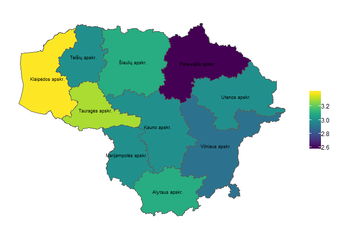
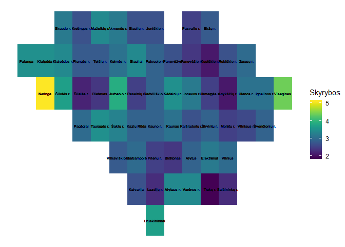
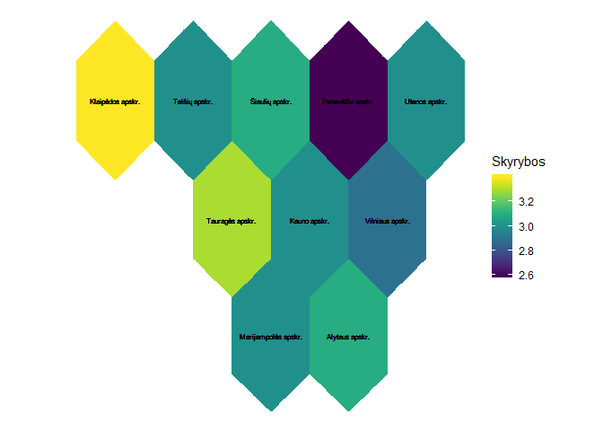
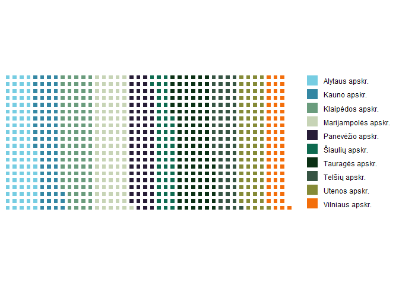

Vizualizacija naudojant geografinius atvaizdus
================

Duomenų pakrovimas
------------------

Pakraunam Higienos instituto atviruosius duomenis apie Lietuvoje gyvenančių žmonių sveikatos rodiklius.

``` r
source("tools/lietuvos_sveikatos_duomenys.R")
res<-load_lietuva("data")
LT = res$LT
LT1 = res$LT1
```

Reikalingos R bibliotekos
-------------------------

``` r
library(tidyr)
library(dplyr)

library(sf)
library(tidyverse)
library(dplyr)
library(tidyr)

library(ggrepel)
library(viridis)
library(geogrid)
library(waffle)
```

Pakraunam geojson žemėlapius
----------------------------

Pakraunam geojson formato žemėlapius, vaizduojančius savivaldybes ir apylinkes (pridedama seniūnijų nuoroda, nors čia nenaudota).

``` r
saviv <- read_sf("https://raw.githubusercontent.com/seporaitis/lt-geojson/master/geojson/municipalities.geojson")
apyl<-read_sf("https://raw.githubusercontent.com/seporaitis/lt-geojson/master/geojson/counties.geojson")
# seniun <- read_sf("https://raw.githubusercontent.com/seporaitis/lt-geojson/master/geojson/subdistricts.geojson")
```

Suformuojame centroidus
-----------------------

``` r
centroids <- saviv %>% 
  st_centroid() %>% 
  bind_cols(as_data_frame(st_coordinates(.)))    # unpack points to lat/lon columns

centroids1 <- apyl %>% 
  st_centroid() %>% 
  bind_cols(as_data_frame(st_coordinates(.)))
```

Vizualinių ir skaitinių duomenų sujungimas
------------------------------------------

Skaitiniai duomenys yra LT ir LT1 dataframes. LT rodikliai buvo renkami 2001-20017 m, o LT1 renkami 2014-2017m.

LT data frame yra šie rodikliai:

-   75 metų amžiaus ir vyresnių gyventojų dalis, %
-   0-17 metų amžiaus gyventojų dalis, %
-   Iki 14 metų gyventojų dalis, %
-   18-44 metų amžiaus gyventojų dalis, %
-   45-64 metų amžiaus gyventojų dalis, %
-   65 metų amžiaus ir vyresnių gyventojų dalis, %
-   Moterų dalis, %
-   Vyrų dalis,%
-   Vidutinis metinis gyventojų skaičius
-   Ištuokų skaičius 1000 gyventojų
-   Santuokų skaičius 1000 gyventojų
-   Gimstamumas 1000 gyventojų
-   Mirtingumas 1000 gyventojų
-   Vidutinė būsimojo gyvenimo trukmė
-   Registruoto nedarbo lygis, darbingo amžiaus (15-64) gyventojų % (darbo biržos duomenimis)

LT1 data frame yra šie rodikliai:

-   Standartizuotas mirtingumo dėl savižudybių rodiklis (X60-X84) 100 000 gyv.
-   Pėsčiųjų mirtingumas dėl transporto įvykių (V00-V09) 100 000 gyv.
-   Socialinės rizikos šeimų skaičius 1000 gyv.
-   Vidutinė tikėtina gyvenimo trukmė
-   Mokyklinio amžiaus vaikų, nesimokančių mokyklose, skaičius 1000 gy.
-   Ilgalaikio nedarbo lygis

Būtent šiuos LT ir LT1 sujungsime su savivaldybių ir apylinkių geojson failais.

``` r
zemelapissavivLT<-LT %>% 
  left_join(saviv, ., by = c('name' = 'name'))
zemelapissavivLT1<-LT1 %>% 
  left_join(saviv, ., by = c('name' = 'name'))

zemelapisaplLT<-LT %>% 
  left_join(apyl, ., by = c('name' = 'name'))
zemelapisaplLT1<-LT1 %>% 
  left_join(apyl, ., by = c('name' = 'name'))
```

Taip pat pataisysime centroidų pavadinimus

``` r
names<-LT%>%filter(metai==2017) %>%select(name, regionas)
centroidsapl<-left_join(centroids1, names, by=c("name", "name"))
centroidssav<-left_join(centroids, names, by=c("name", "name"))
```

Žemėlapių vaizdavimas
---------------------

Pradžiai, pažymėsime tik 2017 metus

``` r
pvz1<-zemelapisaplLT%>%filter(metai==2017)
pvz2<-zemelapissavivLT%>%filter(metai==2017)
```

Pavaizduosime skyrybų dažnumą 2017 m.pagal apylinkes

``` r
ggplot(pvz1)  +
  geom_sf(aes(fill = istuokos))  + 
  geom_text(aes(X, Y, label = regionas), data = centroidsapl, size = 2.3, color = 'black')+
  scale_fill_viridis()+
  theme(
    panel.background = element_rect(fill = "white", colour = "white", size = 0.5, linetype = "solid"), 
    axis.title.x=element_blank(),
    axis.text.x=element_blank(),
    axis.ticks.x=element_blank(),
    axis.title.y=element_blank(),
    axis.text.y=element_blank(),
    axis.ticks.y=element_blank())+
  theme(legend.title=element_blank())
```



Kaip skyrybos keitės apylinkėse skirtingais metais?

``` r
ggplot(zemelapisaplLT)  +
  geom_sf(aes(fill = istuokos))  + 
  geom_text(aes(X, Y, label = regionas), data = centroidsapl, size = 1.5, color = 'black')+
  facet_wrap(~metai)+
  scale_fill_viridis()+
  theme(
    panel.background = element_rect(fill = "white", colour = "white", size = 0.5, linetype = "solid"), 
    axis.title.x=element_blank(),
    axis.text.x=element_blank(),
    axis.ticks.x=element_blank(),axis.title.y=element_blank(),
    axis.text.y=element_blank(),
    axis.ticks.y=element_blank())+
  theme(legend.title=element_blank())
```


Tuomet pavaizduosime skyrybų dažnumą 2017 m.pagal savivaldybes

``` r
ggplot(pvz2)  +
  geom_sf(aes(fill = istuokos))  + 
  geom_text_repel(aes(X, Y, label = regionas), data = centroidssav, size = 2.3, color = 'black')+
  scale_fill_viridis()+
  theme(
    panel.background = element_rect(fill = "white", colour = "white", size = 0.5, linetype = "solid"), 
    axis.title.x=element_blank(),
    axis.text.x=element_blank(),
    axis.ticks.x=element_blank(),axis.title.y=element_blank(),
    axis.text.y=element_blank(),
    axis.ticks.y=element_blank())+
  theme(legend.title=element_blank())
```


p.s. spalvų variantai žemėlapiams: scale\_fill\_viridis() scale\_fill\_viridis(option = "inferno") scale\_fill\_viridis(option = "cividis") scale\_fill\_gradient(low='gray80', high='midnightblue')

žemėlapio kaip korio, vaizdavimas
---------------------------------

Duomenų paruošimas

``` r
tmp<-as(pvz2, 'Spatial')
tmp1 <- calculate_grid(shape = tmp, grid_type = "regular", seed = 9)

df_hex <- assign_polygons(tmp, tmp1)

clean <- function(shape) {
  shape@data$id = rownames(shape@data)
  shape.points = fortify(shape, region="id")
  shape.df = merge(shape.points, shape@data, by="id")}
df_hex_clean<- clean(df_hex)
```

Vaizdavimas:

``` r
ggplot(df_hex_clean) +
  geom_polygon(aes(x = long, y = lat, fill = istuokos, group = group)) +
  geom_text(aes(V1, V2, label = regionas), size=1.8) +
  theme_void() +
  coord_map() +
  scale_fill_viridis(name="Skyrybos")
```



Apylinkėms duomenys:

``` r
tmp<-as(pvz1, 'Spatial')
tmp1 <- calculate_grid(shape = tmp, grid_type = "hexagonal", seed = 7)

df_hex <- assign_polygons(tmp, tmp1)

clean <- function(shape) {
  shape@data$id = rownames(shape@data)
  shape.points = fortify(shape, region="id")
  shape.df = merge(shape.points, shape@data, by="id")}
df_hex_clean<- clean(df_hex)
```

Vaizdavimas:

``` r
ggplot(df_hex_clean) +
  geom_polygon(aes(x = long, y = lat, fill = istuokos, group = group)) +
  geom_text(aes(V1, V2, label = regionas), size=2) +
  theme_void() +
  coord_map()+
  scale_fill_viridis(name="Skyrybos")
```



Vafliaus grafikas
-----------------

Duomenų paruošimas. Pažiūrėsim, kiek vaikų nesimokė mokyklose 2017 metais pagal apylinkes

``` r
vaflius<-LT1%>%filter(metai==2017, ID %in% c("62":"71"))
vafliusproc <- vaflius$vaikai_nesimokantys_mok
names(vafliusproc) <- vaflius$regionas
```

Vaizdavimas:


