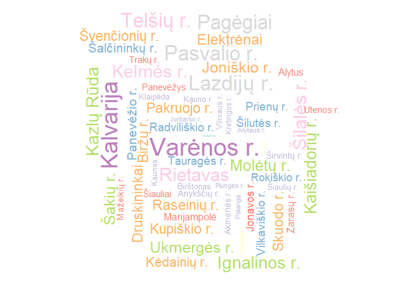
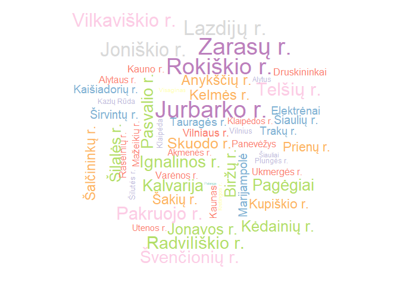
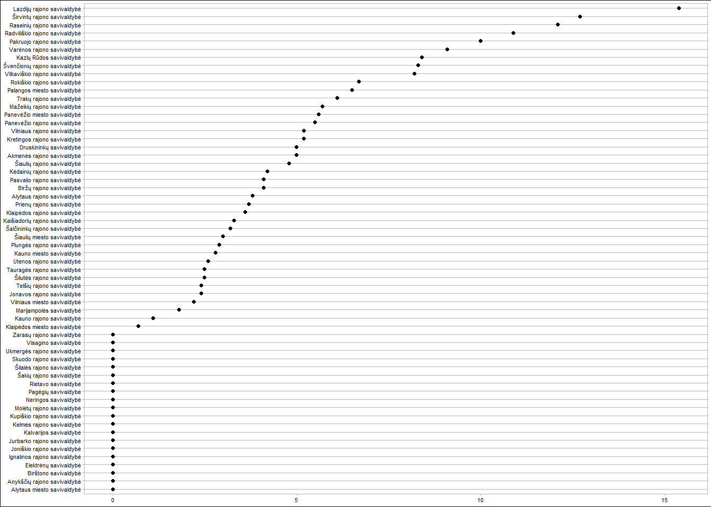
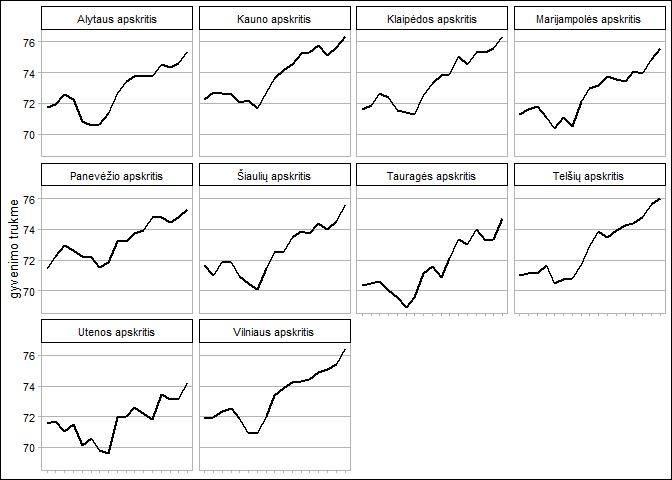

Linijos ir žodžių debesys
================

Duomenų pakrovimas
------------------

Pakraunam Higienos instituto atviruosius duomenis apie Lietuvoje gyvenančių žmonių sveikatos rodiklius.

``` r
source("tools/lietuvos_sveikatos_duomenys.R")
res<-load_lietuva("data")
LT = res$LT
LT1 = res$LT1
```

Reikalingos R bibliotekos
-------------------------

``` r
library(ggplot2)
library(tidyr)
library(dplyr)
library(RColorBrewer)
library(reshape2)
library(scales)
library(ggthemes)
library(wesanderson)
library(viridis)
library(ggsci)
library(ggrepel)
library(wordcloud)
```

worldcloud
----------

Pažiūrėsime, kaip pasikeitė mirtingumas nuo savižudybiu regionuose per 3 metus.

``` r
LT11<-LT1 %>% filter(metai==2014, ID %in% c("1":"60")) 
wordcloud(LT11$regionas, LT11$savizudybiu_mirtingumas, colors=brewer.pal(10, "Set3"), scale = c(2.5, 0.2), rot.per=0.35)
```

    ## Warning in wordcloud(LT11$regionas, LT11$savizudybiu_mirtingumas, colors =
    ## brewer.pal(10, : Neringa could not be fit on page. It will not be plotted.



2014 metai

``` r
LT11<-LT1 %>% filter(metai==2017,ID %in% c("1":"60")) 
wordcloud(LT11$regionas, LT11$savizudybiu_mirtingumas, colors=brewer.pal(10, "Set3"), scale = c(2.5, 0.2), rot.per=0.35)
```



2017 metai

Linijos - taškai
----------------

Alternatyva stulpeliniam grafikui.

Koks pėsčiųjų mirtingumas buvo 2017 metais savivaldybėse?

``` r
LT1 %>% filter(metai=="2017", ID %in% c("1":"60"))%>%
ggplot(aes(x = pesciuju_mirtingumas, y = reorder(name, pesciuju_mirtingumas)))+
  geom_point(size=2)+
  theme_calc()+
  theme(axis.title.y=element_blank(), axis.title.x=element_blank())+scale_color_d3()
```



Kreivės
-------

Pavaizduosime būsimo gyvenimo trukmės pokyčius 2001-2017 m. apylinkėse

``` r
LT %>% filter(ID %in% c("62":"71"))%>%
ggplot(aes(x=metai, y=busimojo_gyvenimo_trukme, group=1))+
  geom_line(size=1) +
  theme_calc()+
  facet_wrap(~name)+
  theme(axis.title.x=element_blank(), axis.text.x=element_blank())+ labs(y = "gyvenimo trukme")
```


