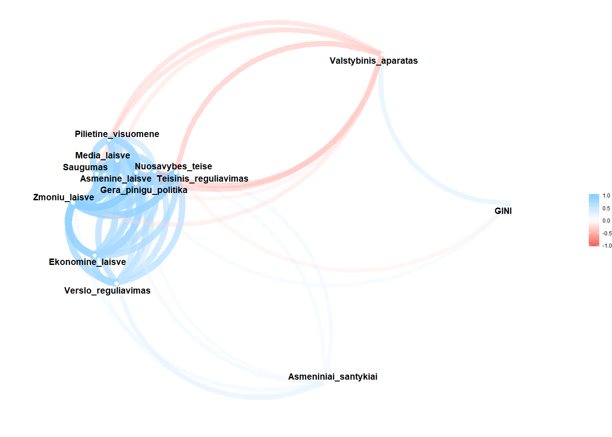

Ryšiai
================

Duomenų pakrovimas
------------------

``` r
source("tools/human_freedom_GINI_duomenys.R")
res<-load_europe("data")
europa = res$europa
gini = res$gini
```

Grafikams naudosime Human Freedom Index ir GINI duomenis.

Bibliotekos
-----------

``` r
library(tidyr)
library(dplyr)
library(ggplot2)

library(RColorBrewer)
library(reshape2)
library(readr)
#library(gglabeller)
library(scales)
library(ggthemes)
library(wesanderson)
library(viridis)
library(ggsci)
library(ggrepel)

library(corrplot)
library(corrr)
library(GGally)
```

Koreliacijos matrica
--------------------

Paruošiame duomenis

``` r
eu<- filter(europa, year==2015)
eu<- select(eu, GINI =indeksas,  Teisinis_reguliavimas = pf_rol,
            Saugumas  = pf_ss, Pilietine_visuomene= pf_association,
            Media_laisve =pf_expression, Asmeniniai_santykiai= pf_identity,
            Valstybinis_aparatas= ef_government, Nuosavybes_teise=ef_legal,
            Gera_pinigu_politika = ef_money, Verslo_reguliavimas = ef_regulation,
            Asmenine_laisve = pf_score, Ekonomine_laisve=ef_score, Zmoniu_laisve=hf_score)
correlation_matrix <- cor(eu, use="pairwise.complete.obs")
```

1 Vizualizacija

``` r
corrplot(correlation_matrix,
         method = "square",
         type = "upper",
         tl.col = "black",
         col = brewer.pal(n = 5, name = "RdYlBu"))
```


2 Vizualizacija

``` r
corrplot.mixed(correlation_matrix, tl.col = "black")
```


Duomenys

``` r
correlate(eu)
```

    ## 
    ## Correlation method: 'pearson'
    ## Missing treated using: 'pairwise.complete.obs'

    ## # A tibble: 13 x 14
    ##    rowname      GINI Teisinis_reguli~ Saugumas Pilietine_visuo~
    ##    <chr>       <dbl>            <dbl>    <dbl>            <dbl>
    ##  1 GINI     NA                 -0.205   0.0132           0.0271
    ##  2 Teisin~  -2.05e-1           NA       0.666            0.635 
    ##  3 Saugum~   1.32e-2            0.666  NA                0.774 
    ##  4 Piliet~   2.71e-2            0.635   0.774           NA     
    ##  5 Media_~  -1.49e-1            0.815   0.771            0.781 
    ##  6 Asmeni~  -1.61e-1            0.239   0.213           -0.136 
    ##  7 Valsty~   4.00e-1           -0.475  -0.365           -0.380 
    ##  8 Nuosav~  -1.06e-1            0.930   0.574            0.542 
    ##  9 Gera_p~   2.06e-1            0.506   0.813            0.635 
    ## 10 Verslo~  -8.40e-2            0.673   0.597            0.454 
    ## 11 Asmeni~  -1.21e-1            0.896   0.883            0.823 
    ## 12 Ekonom~   1.81e-1            0.719   0.740            0.595 
    ## 13 Zmoniu~   6.68e-4            0.877   0.878            0.779 
    ## # ... with 9 more variables: Media_laisve <dbl>,
    ## #   Asmeniniai_santykiai <dbl>, Valstybinis_aparatas <dbl>,
    ## #   Nuosavybes_teise <dbl>, Gera_pinigu_politika <dbl>,
    ## #   Verslo_reguliavimas <dbl>, Asmenine_laisve <dbl>,
    ## #   Ekonomine_laisve <dbl>, Zmoniu_laisve <dbl>

``` r
melted_cormat <- melt(correlation_matrix)
head(melted_cormat)
```

    ##                    Var1 Var2       value
    ## 1                  GINI GINI  1.00000000
    ## 2 Teisinis_reguliavimas GINI -0.20499575
    ## 3              Saugumas GINI  0.01316987
    ## 4   Pilietine_visuomene GINI  0.02705349
    ## 5          Media_laisve GINI -0.14920907
    ## 6  Asmeniniai_santykiai GINI -0.16117260

3 Vizualizacija

``` r
eu %>% correlate() %>% network_plot(min_cor=0.2)
```

    ## 
    ## Correlation method: 'pearson'
    ## Missing treated using: 'pairwise.complete.obs'



``` r
network_plot(correlate(eu), min_cor=0.2)
```

    ## 
    ## Correlation method: 'pearson'
    ## Missing treated using: 'pairwise.complete.obs'


4 Vizualizacija

``` r
ggpairs(eu)
```


5 Vizualizacija

``` r
ggcorr(eu, method = c("pairwise", "spearman", low = "steelblue", mid = "white", high = "darkred"))
```


