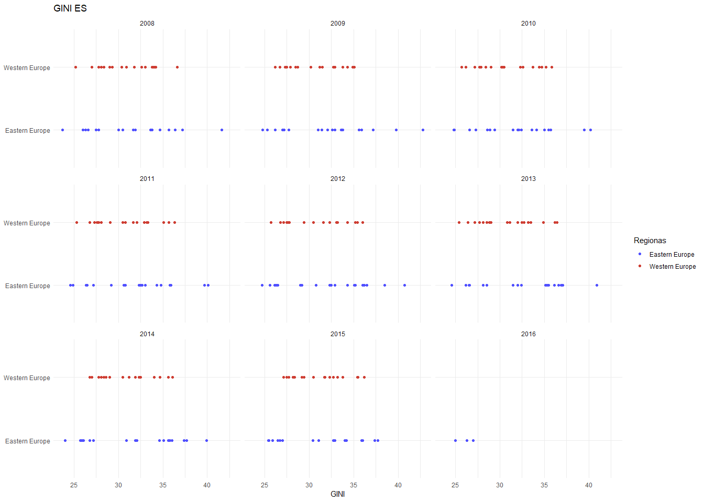
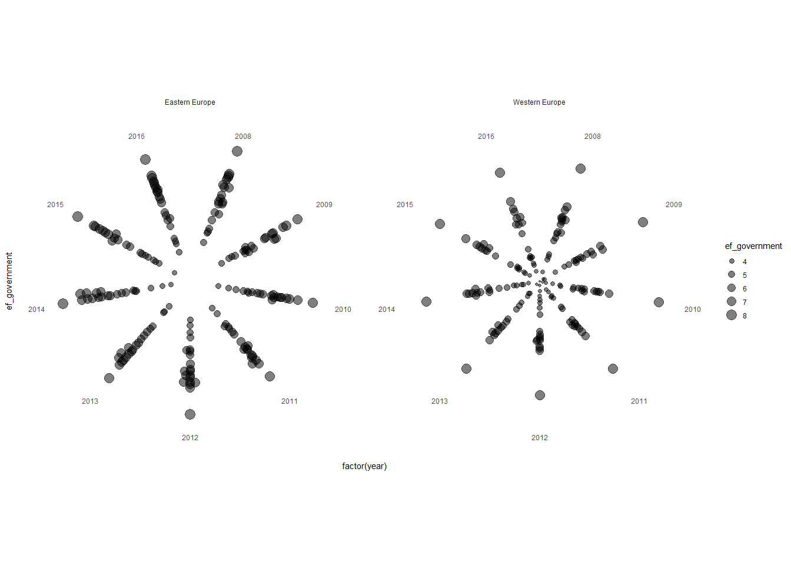

Taškai
================

Duomenų pakrovimas
------------------

``` r
source("tools/human_freedom_GINI_duomenys.R")
res<-load_europe("data")
europa = res$europa
gini = res$gini
```

Grafikams naudosime Human Freedom Index ir GINI duomenis.

Bibliotekos
-----------

``` r
library(tidyr)
library(dplyr)
library(ggplot2)

library(RColorBrewer)
library(reshape2)
library(readr)
#library(gglabeller)
library(scales)
library(ggthemes)
library(wesanderson)
library(viridis)
library(ggsci)
library(ggrepel)

library(waffle)

library(ggbeeswarm)
library(beeswarm)

library(CGPfunctions)
```

Taškinis grafikas
-----------------

Pažiūrėsime ar asmens laisvė eina "koja konjon" su didesne turtine nelygybe

``` r
ggplot(europa, aes(x = indeksas, y = pf_score))+
  geom_text_repel(aes(label=ISO_code), size = 3)+
  facet_wrap(~year, scales = "free")+
  geom_point()+
  theme_classic()+
  labs(title = "Asmens laisvė ir turtinė nelygybė",
       x = "GINI",
       y = "Asmens laisvė")
```


Išryškiname Lietuvą

``` r
ggplot(europa, aes(x = indeksas, y = pf_score))+
  geom_text_repel(aes(label=ISO_code), size = 3)+
  facet_wrap(~year, scales = "free")+
  geom_point(color=ifelse(europa$ISO_code == "LTU", "orange", "black"),
             size=ifelse(europa$ISO_code == "LTU", 5, 2))+
  theme_classic()+
  labs(title = "Asmens laisvė ir turtinė nelygybė",
       x = "GINI",
       y = "Asmens laisvė")
```


Palyginame GINI Vakarų ir Rytų Europoje, pridedame regiono vidurio tašką

``` r
region.labs <- c("Rytų Europa", "Vakarų Europa")
names(region.labs) <- c("Eastern Europe", "Western Europe")
ggplot(europa, aes(x = year, y = indeksas))+
  geom_text_repel(aes(label=ISO_code), size = 3)+
  facet_wrap(~region, labeller = labeller(region = region.labs))+
  geom_point( color=ifelse(europa$ISO_code == "LTU", "orange", "grey"),
              size=ifelse(europa$ISO_code == "LTU", 5, 2))+
  stat_summary(fun.y=mean, aes(group=1), geom="point", colour="blue", size=3)+
  theme_bw()+
  labs(title = "Turtinė nelygybė",
       x = "Metai",
       y = "GINI")
```


Lolipop
-------

``` r
europa %>% filter(year==2016) %>%
  ggplot(aes(x=ef_regulation_labor, y=reorder(countries, ef_regulation_labor, desc=TRUE))) +
  geom_segment(aes(x = 0,
        y=reorder(countries, ef_regulation_labor, desc=TRUE),
        xend = ef_regulation_labor,
        yend = reorder(countries, ef_regulation_labor, desc=TRUE))) +
  geom_point(size=7, color="black") +
  labs(x="Darbo santykių reguliavimas", y="ES šalys", 
       title = "Kaip šalys reguliuoja darbo santykius") +
  theme_minimal() +
   geom_text(aes(label=round(ef_regulation_labor, digits = 1)), size=2.5, color="white", fontface = "bold") +
  theme(panel.border = element_blank(), 
        panel.grid.major = element_blank(),
        panel.grid.minor = element_blank(), 
        axis.line = element_blank(),
        axis.text.x = element_blank())
```


Skirtumų grafikai - reikia "wide"" formato
------------------------------------------

``` r
gi<-select(gini, Country.Code, X2010, X2015)
gi<-na.omit(gi)
```

``` r
ggplot(gi, aes(y = Country.Code)) +
  labs(x = "gini",
       y = "šalys")+
  geom_segment(aes(x = gi$X2010,
                   y = Country.Code,
                   xend = gi$X2015,
                   yend = Country.Code), size = 1)+
  geom_point(aes(x = gi$X2010,
                 color = "2010"),
             size = 5, shape = 20) +
  geom_point(aes(x = gi$X2015,
                 color = "2015"),
             size = 5, shape = 20) +
  theme(legend.position = "bottom")+
  geom_text(aes(x = gi$X2015, label = gi$X2015, size = 12), vjust= -0.2) +#tekstas ant grafiko
  theme(
    panel.background = element_rect(fill = NA),
    panel.grid.major = element_line(colour = "grey90"),
    axis.title.x=element_blank(),
    #axis.text.x=element_blank(),
    axis.ticks.x=element_blank())+
  #axis.title.y=element_blank(),
  #axis.text.y=element_blank(),
  #axis.ticks.y=element_blank())+
  theme(legend.title=element_blank())+
  scale_color_simpsons()
```


Vietoj histogramos
------------------

I variantas

``` r
ggplot(europa, aes(indeksas,region, color= factor(region)))+ 
  geom_beeswarm()+
  facet_wrap(~year)+
  scale_color_igv()+
  labs(x="GINI", y=NULL, title = "GINI ES", color="Regionas")+
  theme_minimal()
```



II variantas

``` r
beeswarm(indeksas~region, europa, method="hex", pch = 16)
```


Išsibarstymas laike Koks valstybės aparato dydis skirtinguose regionuose?

``` r
ggplot(europa, aes(factor(year), ef_government, size=ef_government)) +
  geom_beeswarm(alpha=0.5) +
  coord_polar(direction = 1) +
  theme_minimal() +
  theme(
    axis.text.y=element_blank(), 
    axis.ticks=element_blank(), 
    axis.line.y=element_blank(),
    panel.grid=element_blank())+
  facet_wrap(~region)
```



"Slope" grafikas
----------------

``` r
eur<-europa %>% filter(countries %in% c("Lithuania", "Latvia", "Estonia"))
eur$year<-as.character(eur$year)
  newggslopegraph(eur, year, 
                pf_expression_control,
                countries,
                LineColor = c("black", "blue", "skyblue"),
                LineThickness = 1,
                Title = "Saviraiškos laisvė Baltijos šalyse",
                SubTitle = "poky?iai per 8 metus",
                Caption = NULL)
```


